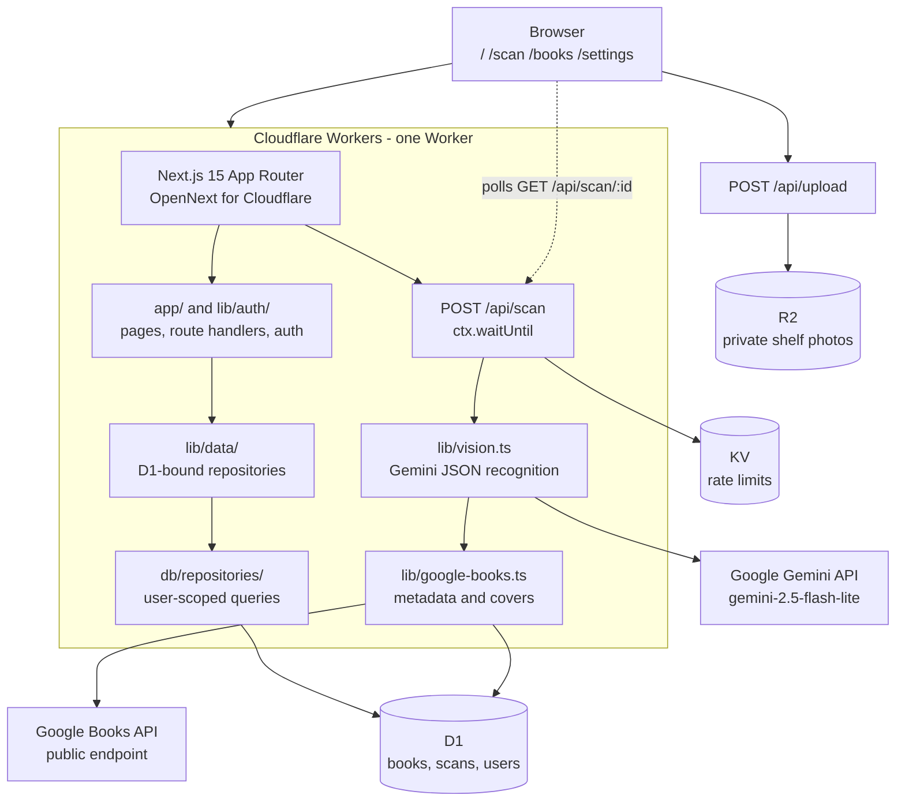

# Book Shelf Manager

Book Shelf Manager turns shelf photos into a searchable personal library. It
recognizes books, enriches them with Google Books metadata, tracks purchase
status, and exports the library to CSV.

The interface is in Traditional Chinese. The source code, comments, and commit
messages are in English.

## Features

- Recognize multiple books from one shelf photo.
- Review uncertain results before keeping them.
- Search, sort, filter, and switch between grid and list views.
- Edit book details, notes, and purchase status.
- Export the whole library or the current filter as Excel-friendly CSV.
- Keep each user's books, scans, and photos isolated.
- Sign in with Google OAuth or email OTP.

## Architecture



Recognition is asynchronous. The upload is stored in R2, the scan endpoint
returns 202, and the browser polls for completion while the Worker processes
the photo and enriches each detected book.

## Technology

| Area              | Technology                                        |
| ----------------- | ------------------------------------------------- |
| Application       | Next.js 15 App Router, React 19, TypeScript       |
| Styling           | Tailwind CSS v4, shadcn/ui, Radix UI              |
| Runtime           | Cloudflare Workers through @opennextjs/cloudflare |
| Database          | Cloudflare D1, SQLite, Drizzle ORM                |
| File storage      | Cloudflare R2, private bucket                     |
| Rate limiting     | Cloudflare KV                                     |
| Authentication    | better-auth with Google OAuth and email OTP       |
| Image recognition | Google Gemini API using gemini-2.5-flash-lite     |
| Book metadata     | Google Books API                                  |
| Testing           | Vitest, workerd, and Playwright                   |

## Data isolation

D1 does not provide row-level security. The application enforces isolation in
the repository layer:

- Every repository function receives userId first.
- Every book and scan query scopes data to that user.
- scripts/check-isolation.ts checks the repository source automatically.
- Repository tests cover cross-user reads, updates, and deletes.
- End-to-end tests cover lists, direct URLs, concurrent sessions, and anonymous
  visitors.

lib/data/ is the only place that binds D1 to repository functions. Application
pages and components cannot access an unscoped database connection.

## Local development and production deployment

The production site runs as a single Cloudflare Worker. The Worker serves the
Next.js application and uses three Cloudflare resources:

- D1 database `book-shelf-manager` for users, sessions, books, and scans.
- Private R2 bucket `book-photos` for uploaded shelf photos.
- KV namespace `RATE_LIMIT` for scan-pipeline rate-limit state.

The deployment is intentionally not self-contained: `npm run deploy` publishes
the Worker, but it does not create Cloudflare resources, apply D1 migrations, or
create OAuth credentials for you. Complete the one-time setup below before
sharing the site with users. A normal release after setup is just:

```bash
npm ci
npm run lint
npm run test
npm run db:migrate:remote   # only when there are new migrations
npm run deploy
```

### Requirements

- Node.js 22 or newer.
- A Cloudflare account for remote D1, R2, KV, and Workers deployment.
- A Google Cloud project for OAuth credentials.
- A Gemini API key for image recognition.
- A Resend account and verified sender domain if production email OTP login is
  required. Without Resend, OTP codes are only written to Worker logs.

### 1. Install dependencies and authenticate with Cloudflare

```bash
git clone <your-repository-url> book-shelf-manager
cd book-shelf-manager
npm ci
npx wrangler login --device
npx wrangler whoami
```

Wrangler prints a verification URL and one-time code. Open that URL in a
browser and approve access; device authorization avoids the temporary
`localhost:8976` OAuth callback, which can fail when the browser and terminal
run in different environments. The postinstall script generates
cloudflare-env.d.ts with Wrangler. The same Cloudflare account used by
Wrangler owns the D1 database, R2 bucket, KV namespace, and Worker.

For CI or a headless machine, use a Cloudflare API token instead. Set the
account ID and token in the CI secret store, not in the repository:

```bash
export CLOUDFLARE_ACCOUNT_ID=<your-account-id>
export CLOUDFLARE_API_TOKEN=<your-api-token>
npx wrangler whoami
```

Keep the token in your shell or CI secret store; never commit it or put it in
`.dev.vars`. The authenticated account must be the account that owns the
Worker and all three production bindings.

### 2. Create and connect Cloudflare resources

```bash
npx wrangler d1 create book-shelf-manager
npx wrangler r2 bucket create book-photos
npx wrangler kv namespace create RATE_LIMIT
```

Run each create command once. If a resource already exists, list the existing
resources and use its ID instead of creating a duplicate:

```bash
npx wrangler d1 list
npx wrangler r2 bucket list
npx wrangler kv namespace list
```

Copy the IDs and names returned by the create commands into
[`wrangler.jsonc`](wrangler.jsonc):

| Command output | `wrangler.jsonc` field        |
| -------------- | ----------------------------- |
| D1 database_id | `d1_databases[0].database_id` |
| KV id          | `kv_namespaces[0].id`         |
| R2 bucket name | Keep `book-photos` unchanged  |

Replace both `REPLACE_ME_...` values before running a remote migration or
deploying. Keep the R2 bucket private; the application reads photos through an
authenticated route rather than exposing the bucket publicly. Do not put
`BETTER_AUTH_URL` in `wrangler.jsonc`: local development reads it from
`.dev.vars`, while production is set as a Worker variable during deployment.
This prevents a production deployment from accidentally using `localhost` for
its OAuth callback.

### 3. Configure local secrets and variables

For local development:

```bash
cp .dev.vars.example .dev.vars
```

Fill in these values in `.dev.vars`:

```text
GEMINI_API_KEY=AIza...
BETTER_AUTH_SECRET=<long-random-secret>
BETTER_AUTH_URL=http://localhost:8787
GOOGLE_CLIENT_ID=<oauth-client-id>
GOOGLE_CLIENT_SECRET=<oauth-client-secret>
```

Generate a local auth secret rather than reusing a production secret:

```bash
openssl rand -base64 32
```

Optional local values are `RESEND_API_KEY`, `OTP_FROM_EMAIL`, and
`TRUSTED_ORIGINS`. Without Resend, OTP codes are written to the local Worker
logs, which is useful for development but is not a production delivery setup.

### 4. Configure production secrets

For production, create the Worker secrets with Wrangler:

```bash
npx wrangler secret put GEMINI_API_KEY
npx wrangler secret put BETTER_AUTH_SECRET
npx wrangler secret put GOOGLE_CLIENT_ID
npx wrangler secret put GOOGLE_CLIENT_SECRET
npx wrangler secret put RESEND_API_KEY       # optional
npx wrangler secret put OTP_FROM_EMAIL       # optional
npx wrangler secret put TRUSTED_ORIGINS      # optional
```

`BETTER_AUTH_URL` is a non-secret Worker variable and is configured in the
deployment step. Set `TRUSTED_ORIGINS` only when the app must accept another
hostname, such as a preview URL or a second custom domain; use a
comma-separated list of origins, for example:

```text
https://preview.example.com,https://books.example.com
```

If using email OTP in production, configure a verified Resend sender and set
`OTP_FROM_EMAIL` to that sender, for example
`Book Shelf Manager <login@example.com>`. Never commit `.dev.vars` or put any
secret in a `NEXT_PUBLIC_` variable.

### 5. Apply the production database migrations

The remote D1 database is separate from the local D1 database used by
`wrangler dev`. Apply migrations explicitly before the first production
deployment:

```bash
npm run db:migrate:remote
npx wrangler d1 migrations list book-shelf-manager --remote
```

When the schema changes, generate and review a migration locally, then apply
that migration to remote D1 before deploying code that depends on it:

```bash
npm run db:generate
# Review the new file in drizzle/ and run the test suite.
npm run db:migrate:remote
```

`npm run db:seed` is intended for local test data. Do not run
`npm run db:seed -- --remote` against a real library unless you deliberately
want the sample users and books; the seed script removes rows for its fixed
sample accounts before inserting them.

### 6. Build and deploy the Worker

The first deploy creates the Worker and prints its `workers.dev` URL:

```bash
npm run cf:build       # optional: build only, useful for catching errors
npm run deploy         # build and publish the Worker
```

Set `BETTER_AUTH_URL` to the exact public origin immediately after you know the
URL, then deploy again. Include the scheme and hostname, but no API path:

```bash
npm run deploy -- --var BETTER_AUTH_URL:https://book-shelf-manager.<account-subdomain>.workers.dev
```

If you already have a custom domain, use that domain instead of the
`workers.dev` URL. `wrangler.jsonc` has `keep_vars` enabled, so later deploys
preserve the Worker variable managed through Wrangler or the Cloudflare
dashboard. If the public hostname changes, set `BETTER_AUTH_URL` again and
update the OAuth redirect URI as well.

The deployment command performs these operations:

- Builds the Next.js app with `opennextjs-cloudflare`.
- Produces `.open-next/worker.js` and `.open-next/assets`.
- Uploads the Worker and static assets using `wrangler.jsonc`.
- Connects the Worker to the configured D1, R2, and KV resources.

It does not apply migrations or upload secrets. Migrations and secrets must be
configured in the earlier steps. A deployment can be inspected with:

```bash
npx wrangler deployments status
npx wrangler deployments list
```

To roll back to a known Worker version, first find its version ID in
`wrangler deployments list`, then run:

```bash
npx wrangler rollback <version-id> --name book-shelf-manager --yes
```

### 7. Configure Google OAuth

In [Google Cloud Console](https://console.cloud.google.com/apis/credentials),
create a Web application OAuth client.

Add these authorized redirect URIs:

```text
http://localhost:8787/api/auth/callback/google
https://<your-worker-url>/api/auth/callback/google
```

Add these authorized JavaScript origins:

```text
http://localhost:8787
https://<your-worker-url>
```

If you use more than one production hostname, put the additional origins in
the `TRUSTED_ORIGINS` secret as a comma-separated list. OAuth must start and
finish on the same hostname so the state cookie is available on the callback.

After changing an OAuth client or hostname, test a fresh private-browser
session. Old cookies can hide an incorrect origin or redirect configuration.

### 8. Attach a custom domain (optional)

The default `workers.dev` hostname is enough for a first deployment. For a
custom hostname, attach the domain to the `book-shelf-manager` Worker through
Cloudflare’s Worker custom-domain settings or Wrangler, wait for the DNS and
TLS certificate to become active, and then:

1. Set `BETTER_AUTH_URL` to `https://books.example.com` and redeploy.
2. Add `https://books.example.com/api/auth/callback/google` to Google’s
   authorized redirect URIs.
3. Add `https://books.example.com` to Google’s authorized JavaScript origins.
4. Remove the old hostname only after sign-in has been tested on the new one.

Do not use a URL with `/api/auth` or another path as `BETTER_AUTH_URL`; it must
be the origin users see in the browser. If both the old and new hosts must
remain usable, keep the additional host in `TRUSTED_ORIGINS`.

### 9. Verify the deployed site

Use the URL configured in `BETTER_AUTH_URL` for the smoke test:

```bash
curl -I https://<public-hostname>
```

Then verify the application in a browser:

- The landing page loads over HTTPS.
- Google OAuth returns to the same hostname and creates a session.
- Email OTP delivers a code if Resend is configured.
- A JPEG, PNG, WebP, or HEIC shelf photo up to 10 MB can be uploaded.
- The scan progresses from upload to completion and detected books appear.
- A book can be edited and the CSV export downloads successfully.
- A second account cannot see the first account’s books or scan photos.

If a scan fails, check the Worker logs and confirm `GEMINI_API_KEY` is present
and its provider quota is available. Google Books metadata is fetched from a
public API and does not require another secret.

### 10. Run locally

```bash
# Next.js development server without Cloudflare bindings
npm run dev

# Full Worker runtime with local D1, R2, and KV
npm run cf:dev
```

The full Worker runs at http://localhost:8787. Optional seed data creates two
users with twenty books each:

```bash
npm run db:seed
```

For automatic deploys from GitHub, connect the repository in Cloudflare
Workers Builds, select the production branch, and use:

- Build command: `npm run cf:build`
- Deploy command: `npx opennextjs-cloudflare deploy`

Configure the same runtime secrets and `BETTER_AUTH_URL` in the Worker’s
Variables and Secrets settings. The build must have access to the repository,
but runtime secrets belong in Cloudflare and should not be committed to GitHub.
Because the build configuration does not run database migrations, add
`npm run db:migrate:remote` as a separate, controlled release step when a
migration is part of the change. The local `npm run deploy` flow remains the
reference path for first-time setup and troubleshooting.

## Commands

| Command                   | Purpose                                   |
| ------------------------- | ----------------------------------------- |
| npm run dev               | Start the Next.js development server      |
| npm run cf:dev            | Build and run the local Cloudflare Worker |
| npm run cf:build          | Build the OpenNext Worker bundle          |
| npm run deploy            | Build and deploy through OpenNext         |
| npm run lint              | Run ESLint, TypeScript, and safety checks |
| npm run format            | Format source files with Prettier         |
| npm run test              | Run Vitest tests in workerd               |
| npm run test:e2e          | Run Playwright end-to-end tests           |
| npm run db:generate       | Generate a Drizzle migration              |
| npm run db:migrate:local  | Apply migrations to local D1              |
| npm run db:migrate:remote | Apply migrations to remote D1             |
| npm run db:seed           | Insert local seed data                    |

## Testing

```bash
npm run lint
npm run test
npm run cf:build
npm run test:e2e
```

The unit tests run in workerd against local D1, R2, and KV bindings. Gemini and
Google Books are mocked in tests, so no paid API calls are made by the test
suite.

The application has a per-user scan limit and a shared daily recognition cap to
keep free-tier provider usage bounded. Free Gemini usage may have provider
terms about data use; review Google's current terms before storing sensitive
photos.

## Project structure

```text
app/                 Pages, layouts, server actions, and API routes
components/          React UI components
db/                  D1 schema and user-scoped repositories
drizzle/             SQL migrations
lib/vision.ts        Gemini image-recognition client
lib/google-books.ts  Google Books metadata client
lib/scan-pipeline.ts Async recognition and enrichment workflow
scripts/              Isolation and schema checks plus seed data
e2e/                 Playwright tests
wrangler.jsonc       Cloudflare Worker configuration
DECISIONS.md         Architecture decisions and trade-offs
```

## License

Personal project; no license has been selected yet.
