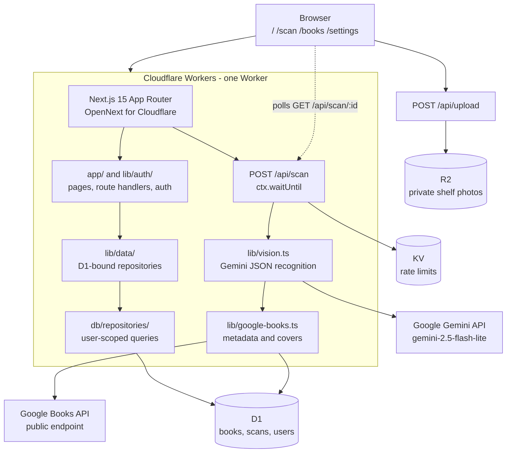

# Book Shelf Manager

Book Shelf Manager turns shelf photos into a searchable personal library. It
recognizes books, enriches them with Google Books metadata, tracks purchase
status, and exports the library to CSV.

The interface is in Traditional Chinese. The source code, comments, and commit
messages are in English.

## Features

- Recognize multiple books from one shelf photo.
- Review uncertain results before keeping them.
- Search, sort, filter, and switch between grid and list views.
- Edit book details, notes, and purchase status.
- Export the whole library or the current filter as Excel-friendly CSV.
- Keep each user's books, scans, and photos isolated.
- Sign in with Google OAuth or email OTP.

## Architecture



Recognition is asynchronous. The upload is stored in R2, the scan endpoint
returns 202, and the browser polls for completion while the Worker processes
the photo and enriches each detected book.

## Technology

| Area              | Technology                                        |
| ----------------- | ------------------------------------------------- |
| Application       | Next.js 15 App Router, React 19, TypeScript       |
| Styling           | Tailwind CSS v4, shadcn/ui, Radix UI              |
| Runtime           | Cloudflare Workers through @opennextjs/cloudflare |
| Database          | Cloudflare D1, SQLite, Drizzle ORM                |
| File storage      | Cloudflare R2, private bucket                     |
| Rate limiting     | Cloudflare KV                                     |
| Authentication    | better-auth with Google OAuth and email OTP       |
| Image recognition | Google Gemini API using gemini-2.5-flash-lite     |
| Book metadata     | Google Books API                                  |
| Testing           | Vitest, workerd, and Playwright                   |

## Data isolation

D1 does not provide row-level security. The application enforces isolation in
the repository layer:

- Every repository function receives userId first.
- Every book and scan query scopes data to that user.
- scripts/check-isolation.ts checks the repository source automatically.
- Repository tests cover cross-user reads, updates, and deletes.
- End-to-end tests cover lists, direct URLs, concurrent sessions, and anonymous
  visitors.

lib/data/ is the only place that binds D1 to repository functions. Application
pages and components cannot access an unscoped database connection.

## Local setup

### Requirements

- Node.js 22 or newer.
- A Cloudflare account for remote D1, R2, KV, and Workers deployment.
- A Google Cloud project for OAuth credentials.
- A Gemini API key for image recognition.

### 1. Install

```bash
git clone <your-repository-url> book-shelf-manager
cd book-shelf-manager
npm ci
npx wrangler login
```

The postinstall script generates cloudflare-env.d.ts with Wrangler.

### 2. Create Cloudflare resources

```bash
npx wrangler d1 create book-shelf-manager
npx wrangler r2 bucket create book-photos
npx wrangler kv namespace create RATE_LIMIT
```

Copy the returned IDs into wrangler.jsonc:

| Command output | wrangler.jsonc field                          |
| -------------- | --------------------------------------------- |
| D1 database_id | d1_databases[0].database_id                   |
| KV id          | kv_namespaces[0].id                           |
| R2 bucket name | Keep r2_buckets[0].bucket_name as book-photos |

Set vars.BETTER_AUTH_URL to the URL users will visit. For local development it
should be http://localhost:8787. For production it should be the deployed
Worker URL.

### 3. Configure Google OAuth

In [Google Cloud Console](https://console.cloud.google.com/apis/credentials),
create a Web application OAuth client.

Add these authorized redirect URIs:

```text
http://localhost:8787/api/auth/callback/google
https://<your-worker-url>/api/auth/callback/google
```

Add these authorized JavaScript origins:

```text
http://localhost:8787
https://<your-worker-url>
```

If you use more than one production hostname, put the additional origins in
the TRUSTED_ORIGINS secret as a comma-separated list.

### 4. Configure secrets

For local development:

```bash
cp .dev.vars.example .dev.vars
```

Fill in these values in .dev.vars:

```text
GEMINI_API_KEY=AIza...
BETTER_AUTH_SECRET=<long-random-secret>
GOOGLE_CLIENT_ID=<oauth-client-id>
GOOGLE_CLIENT_SECRET=<oauth-client-secret>
```

Optional values are RESEND_API_KEY, OTP_FROM_EMAIL, and TRUSTED_ORIGINS.
Without Resend, OTP codes are written to local logs.

For production, create the Worker secrets with Wrangler:

```bash
npx wrangler secret put GEMINI_API_KEY
npx wrangler secret put BETTER_AUTH_SECRET
npx wrangler secret put GOOGLE_CLIENT_ID
npx wrangler secret put GOOGLE_CLIENT_SECRET
npx wrangler secret put RESEND_API_KEY       # optional
npx wrangler secret put OTP_FROM_EMAIL       # optional
npx wrangler secret put TRUSTED_ORIGINS      # optional
```

Never commit .dev.vars or put these values in a NEXT_PUBLIC_ variable.

### 5. Apply database migrations

```bash
# Local D1
npm run db:migrate:local

# Remote D1
npm run db:migrate:remote
```

After changing db/schema.ts, generate a migration before applying it:

```bash
npm run db:generate
```

### 6. Run locally

```bash
# Next.js development server without Cloudflare bindings
npm run dev

# Full Worker runtime with local D1, R2, and KV
npm run cf:dev
```

The full Worker runs at http://localhost:8787. Optional seed data creates two
users with twenty books each:

```bash
npm run db:seed
```

## GitHub deployment

There are two supported ways to deploy from GitHub.

### Option A: Cloudflare Workers Builds

This is the simplest option and is managed by Cloudflare:

1. Push this repository to GitHub.
2. In the Cloudflare dashboard, open Workers & Pages.
3. Select Create application and Import a repository.
4. Choose the GitHub repository and set the root directory to the repository
   root.
5. Use npm run cf:build as the build command.
6. Use npx wrangler deploy as the deploy command.
7. Configure runtime variables and secrets in the Worker's Settings >
   Variables and Secrets page.

See the [Cloudflare Workers Builds documentation](https://developers.cloudflare.com/workers/ci-cd/builds/)
for the current dashboard flow. The Worker name must match the name in
wrangler.jsonc.

### Option B: GitHub Actions

Create a repository Actions secret named CLOUDFLARE_API_TOKEN and another named
CLOUDFLARE_ACCOUNT_ID. The API token should have the permissions needed to
deploy Workers and update the D1, R2, and KV resources used by this project.

GitHub encrypts Actions secrets and makes them available only to workflows. See
the [GitHub Actions secrets documentation](https://docs.github.com/en/actions/security-for-github-actions/security-guides/using-secrets).

Add .github/workflows/deploy.yml:

```yaml
name: Deploy Worker

on:
  push:
    branches: [main]

permissions:
  contents: read

jobs:
  deploy:
    runs-on: ubuntu-latest
    steps:
      - uses: actions/checkout@v4

      - uses: actions/setup-node@v4
        with:
          node-version: 22
          cache: npm

      - run: npm ci
      - run: npm run cf:build
      - run: npx wrangler deploy
        env:
          CLOUDFLARE_API_TOKEN: ${{ secrets.CLOUDFLARE_API_TOKEN }}
          CLOUDFLARE_ACCOUNT_ID: ${{ secrets.CLOUDFLARE_ACCOUNT_ID }}
```

Provision the runtime Worker secrets once with Wrangler or in the Cloudflare
dashboard. Do not pass GEMINI_API_KEY, OAuth credentials, or
BETTER_AUTH_SECRET through the build command; they are runtime secrets, not
build credentials.

After the first deployment, update the production BETTER_AUTH_URL and add the
production OAuth redirect URI in Google Cloud Console.

## Commands

| Command                   | Purpose                                   |
| ------------------------- | ----------------------------------------- |
| npm run dev               | Start the Next.js development server      |
| npm run cf:dev            | Build and run the local Cloudflare Worker |
| npm run cf:build          | Build the OpenNext Worker bundle          |
| npm run deploy            | Build and deploy through OpenNext         |
| npm run lint              | Run ESLint, TypeScript, and safety checks |
| npm run format            | Format source files with Prettier         |
| npm run test              | Run Vitest tests in workerd               |
| npm run test:e2e          | Run Playwright end-to-end tests           |
| npm run db:generate       | Generate a Drizzle migration              |
| npm run db:migrate:local  | Apply migrations to local D1              |
| npm run db:migrate:remote | Apply migrations to remote D1             |
| npm run db:seed           | Insert local seed data                    |

## Testing

```bash
npm run lint
npm run test
npm run cf:build
npm run test:e2e
```

The unit tests run in workerd against local D1, R2, and KV bindings. Gemini and
Google Books are mocked in tests, so no paid API calls are made by the test
suite.

The application has a per-user scan limit and a shared daily recognition cap to
keep free-tier provider usage bounded. Free Gemini usage may have provider
terms about data use; review Google's current terms before storing sensitive
photos.

## Project structure

```text
app/                 Pages, layouts, server actions, and API routes
components/          React UI components
db/                  D1 schema and user-scoped repositories
drizzle/             SQL migrations
lib/vision.ts        Gemini image-recognition client
lib/google-books.ts  Google Books metadata client
lib/scan-pipeline.ts Async recognition and enrichment workflow
scripts/              Isolation and schema checks plus seed data
e2e/                 Playwright tests
wrangler.jsonc       Cloudflare Worker configuration
DECISIONS.md         Architecture decisions and trade-offs
```

## License

Personal project; no license has been selected yet.
