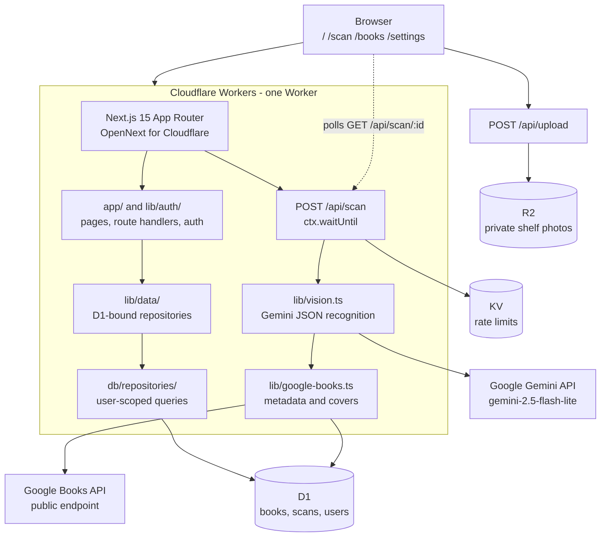

# Book Shelf Manager

Book Shelf Manager turns shelf photos into a searchable personal library. It
recognizes books, enriches them with Google Books metadata, tracks purchase
status, and exports the library to CSV.

The interface is in Traditional Chinese. The source code, comments, and commit
messages are in English.

## Features

- Recognize multiple books from one shelf photo.
- Review uncertain results before keeping them.
- Search, sort, filter, and switch between grid and list views.
- Edit book details, notes, and purchase status.
- Export the whole library or the current filter as Excel-friendly CSV.
- Keep each user's books, scans, and photos isolated.
- Sign in with Google OAuth or email OTP.

## Architecture



Recognition is asynchronous. The upload is stored in R2, the scan endpoint
returns 202, and the browser polls for completion while the Worker processes
the photo and enriches each detected book.

## Technology

| Area              | Technology                                        |
| ----------------- | ------------------------------------------------- |
| Application       | Next.js 15 App Router, React 19, TypeScript       |
| Styling           | Tailwind CSS v4, shadcn/ui, Radix UI              |
| Runtime           | Cloudflare Workers through @opennextjs/cloudflare |
| Database          | Cloudflare D1, SQLite, Drizzle ORM                |
| File storage      | Cloudflare R2, private bucket                     |
| Rate limiting     | Cloudflare KV                                     |
| Authentication    | better-auth with Google OAuth and email OTP       |
| Image recognition | Google Gemini API using gemini-2.5-flash-lite     |
| Book metadata     | Google Books API                                  |
| Testing           | Vitest, workerd, and Playwright                   |

## Data isolation

D1 does not provide row-level security. The application enforces isolation in
the repository layer:

- Every repository function receives userId first.
- Every book and scan query scopes data to that user.
- scripts/check-isolation.ts checks the repository source automatically.
- Repository tests cover cross-user reads, updates, and deletes.
- End-to-end tests cover lists, direct URLs, concurrent sessions, and anonymous
  visitors.

lib/data/ is the only place that binds D1 to repository functions. Application
pages and components cannot access an unscoped database connection.

## Local setup

### Requirements

- Node.js 22 or newer.
- A Cloudflare account for remote D1, R2, KV, and Workers deployment.
- A Google Cloud project for OAuth credentials.
- A Gemini API key for image recognition.

### 1. Install and log in

```bash
git clone <your-repository-url> book-shelf-manager
cd book-shelf-manager
npm ci
npx wrangler login --device
```

Wrangler prints a verification URL and one-time code. Open that URL in a
browser and approve access; device authorization avoids the temporary
`localhost:8976` OAuth callback, which can fail when the browser and terminal
run in different environments. The postinstall script generates
cloudflare-env.d.ts with Wrangler. The same Cloudflare account used by
Wrangler owns the D1 database, R2 bucket, KV namespace, and Worker.

For CI or a headless machine, use a Cloudflare API token instead:

```bash
export CLOUDFLARE_ACCOUNT_ID=<your-account-id>
export CLOUDFLARE_API_TOKEN=<your-api-token>
npx wrangler whoami
```

Keep the token in your shell or CI secret store; never commit it or put it in
`.dev.vars`.

### 2. Create Cloudflare resources

```bash
npx wrangler d1 create book-shelf-manager
npx wrangler r2 bucket create book-photos
npx wrangler kv namespace create RATE_LIMIT
```

Copy the returned IDs into `wrangler.jsonc`:

| Command output | `wrangler.jsonc` field        |
| -------------- | ----------------------------- |
| D1 database_id | `d1_databases[0].database_id` |
| KV id          | `kv_namespaces[0].id`         |
| R2 bucket name | Keep `book-photos` unchanged  |

Do not put `BETTER_AUTH_URL` in `wrangler.jsonc`. Local development reads it
from `.dev.vars`; production is set once on the deploy command below. This
prevents a production deployment from accidentally using `localhost` for its
OAuth callback.

### 3. Configure local and production secrets

For local development:

```bash
cp .dev.vars.example .dev.vars
```

Fill in these values in `.dev.vars`:

```text
GEMINI_API_KEY=AIza...
BETTER_AUTH_SECRET=<long-random-secret>
GOOGLE_CLIENT_ID=<oauth-client-id>
GOOGLE_CLIENT_SECRET=<oauth-client-secret>
```

Optional values are `RESEND_API_KEY`, `OTP_FROM_EMAIL`, and
`TRUSTED_ORIGINS`. Without Resend, OTP codes are written to local logs.

For production, create the Worker secrets with Wrangler:

```bash
npx wrangler secret put GEMINI_API_KEY
npx wrangler secret put BETTER_AUTH_SECRET
npx wrangler secret put GOOGLE_CLIENT_ID
npx wrangler secret put GOOGLE_CLIENT_SECRET
npx wrangler secret put RESEND_API_KEY       # optional
npx wrangler secret put OTP_FROM_EMAIL       # optional
npx wrangler secret put TRUSTED_ORIGINS      # optional
```

Never commit `.dev.vars` or put these values in a `NEXT_PUBLIC_` variable.

### 4. Apply database migrations

```bash
# Remote D1 used by the deployed Worker
npm run db:migrate:remote
```

After changing `db/schema.ts`, generate a migration before applying it:

```bash
npm run db:generate
```

### 5. Deploy

The deploy script builds the OpenNext Worker and publishes it in one command:

```bash
npm run deploy
```

The first deployment prints the Worker URL. Set the public URL as the OAuth
base URL on the first deploy that serves users:

```bash
npm run deploy -- --var BETTER_AUTH_URL:https://<your-worker-url>
```

`wrangler.jsonc` has `keep_vars` enabled, so later `npm run deploy` commands
preserve this dashboard/CLI-managed value. If users visit a custom domain,
use that exact domain instead of the `workers.dev` URL. If you change domains,
run the command again with the new URL.

### 6. Configure Google OAuth

In [Google Cloud Console](https://console.cloud.google.com/apis/credentials),
create a Web application OAuth client.

Add these authorized redirect URIs:

```text
http://localhost:8787/api/auth/callback/google
https://<your-worker-url>/api/auth/callback/google
```

Add these authorized JavaScript origins:

```text
http://localhost:8787
https://<your-worker-url>
```

If you use more than one production hostname, put the additional origins in
the `TRUSTED_ORIGINS` secret as a comma-separated list. OAuth must start and
finish on the same hostname so the state cookie is available on the callback.

### 7. Run locally

```bash
# Next.js development server without Cloudflare bindings
npm run dev

# Full Worker runtime with local D1, R2, and KV
npm run cf:dev
```

The full Worker runs at http://localhost:8787. Optional seed data creates two
users with twenty books each:

```bash
npm run db:seed
```

For automatic deploys from GitHub, connect the repository in Cloudflare
Workers Builds and use:

- Build command: `npm run cf:build`
- Deploy command: `npx opennextjs-cloudflare deploy`

Configure the same runtime secrets and `BETTER_AUTH_URL` in the Worker’s
Variables and Secrets settings. The local `npm run deploy` flow remains the
reference path for first-time setup and troubleshooting.

## Commands

| Command                   | Purpose                                   |
| ------------------------- | ----------------------------------------- |
| npm run dev               | Start the Next.js development server      |
| npm run cf:dev            | Build and run the local Cloudflare Worker |
| npm run cf:build          | Build the OpenNext Worker bundle          |
| npm run deploy            | Build and deploy through OpenNext         |
| npm run lint              | Run ESLint, TypeScript, and safety checks |
| npm run format            | Format source files with Prettier         |
| npm run test              | Run Vitest tests in workerd               |
| npm run test:e2e          | Run Playwright end-to-end tests           |
| npm run db:generate       | Generate a Drizzle migration              |
| npm run db:migrate:local  | Apply migrations to local D1              |
| npm run db:migrate:remote | Apply migrations to remote D1             |
| npm run db:seed           | Insert local seed data                    |

## Testing

```bash
npm run lint
npm run test
npm run cf:build
npm run test:e2e
```

The unit tests run in workerd against local D1, R2, and KV bindings. Gemini and
Google Books are mocked in tests, so no paid API calls are made by the test
suite.

The application has a per-user scan limit and a shared daily recognition cap to
keep free-tier provider usage bounded. Free Gemini usage may have provider
terms about data use; review Google's current terms before storing sensitive
photos.

## Project structure

```text
app/                 Pages, layouts, server actions, and API routes
components/          React UI components
db/                  D1 schema and user-scoped repositories
drizzle/             SQL migrations
lib/vision.ts        Gemini image-recognition client
lib/google-books.ts  Google Books metadata client
lib/scan-pipeline.ts Async recognition and enrichment workflow
scripts/              Isolation and schema checks plus seed data
e2e/                 Playwright tests
wrangler.jsonc       Cloudflare Worker configuration
DECISIONS.md         Architecture decisions and trade-offs
```

## License

Personal project; no license has been selected yet.
